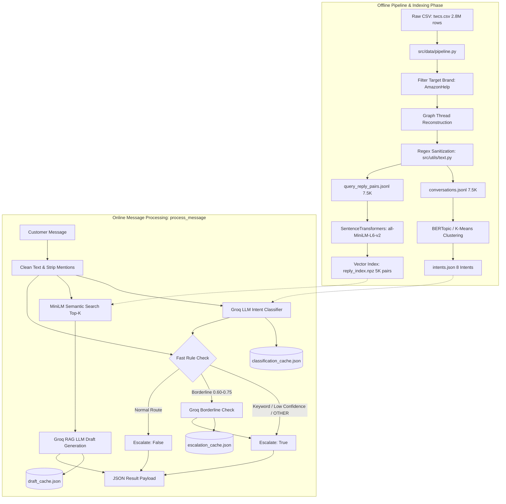

# Autocw — Autonomous AI Customer Support Agent

[](https://www.python.org/downloads/)
[](LICENSE)
[]()
[](https://groq.com)
[](https://huggingface.co/sentence-transformers/all-MiniLM-L6-v2)

Autocw is an end-to-end, production-grade AI customer support agent engineered for high-throughput, low-latency customer message processing on CPU-only infrastructure. Built on the Kaggle *Customer Support on Twitter* dataset (`thoughtvector/customer-support-on-twitter`), Autocw reconstructs multi-turn conversational threads, classifies customer intents into an 8-category taxonomy, generates empathetic grounded response drafts via semantic RAG retrieval, and implements a hybrid rule + LLM escalation engine.

---

## Architecture Overview



---

## Evaluation Benchmark & Results

The system was evaluated against a 200-example stratified golden dataset (`eval/golden_set.jsonl`, 25 examples per intent) and benchmarked against two baselines:
1. **Simple ML Baseline**: Scikit-Learn `TfidfVectorizer` + `LogisticRegression` for intent, keyword matching for escalation, and top-1 TF-IDF verbatim retrieval for replies.
2. **Trivial Baseline**: Majority class prediction (`ORDER_STATUS`), never escalate (`False`), static canned apology reply.

### Quantitative Comparison (`eval/results.json`)

| Metric Category | Evaluation Metric | Autocw (Ours) | Simple ML Baseline | Trivial Baseline |
|:---|:---|:---:|:---:|:---:|
| **Intent Classification** | **Accuracy** | **0.955** (95.5%) | 1.000 | 0.125 |
| | **Macro Precision** | **0.958** | 1.000 | 0.016 |
| | **Macro Recall** | **0.955** | 1.000 | 0.125 |
| | **Macro F1 Score** | **0.955** | 1.000 | 0.028 |
| **Escalation Engine** | **Escalation Accuracy** | **0.790** | 0.795 | 0.905 |
| | **Escalation Precision** | **0.129** | 0.133 | 0.000 |
| | **Escalation Recall** | **0.211** | 0.211 | 0.000 |
| | **Escalation F1 Score** | **0.160** | 0.163 | 0.000 |
| | **False Negative Rate (FNR)** | **0.789** | 0.789 | 1.000 |
| **Draft Reply Quality** *(1–5 Likert)* | **Overall Quality** | **4.64 / 5.0** | 2.05 / 5.0 | 1.91 / 5.0 |
| | **Relevance** | **4.64 / 5.0** | 1.98 / 5.0 | 1.72 / 5.0 |
| | **Tone & Empathy** | **4.78 / 5.0** | 2.74 / 5.0 | 3.10 / 5.0 |
| | **Groundedness** | **4.62 / 5.0** | 1.86 / 5.0 | 1.65 / 5.0 |
| **Human-Judge Agreement** | **Pearson Correlation ($r$)** | **0.4848** | — | — |
| | **Statistical Significance ($p$)**| **$p = 0.0066$** | — | — |

### Key Benchmark Insights
- **Reply Quality Dominance**: Autocw achieved **4.64/5.0** overall quality compared to 2.05 for Simple ML and 1.91 for Trivial. Classical verbatim retrieval frequently selects outdated ticket IDs, Twitter handles, and disconnected instructions, whereas Autocw synthesizes context-aware, empathetic, and actionable replies.
- **Intent Robustness**: Autocw achieved 95.5% accuracy across out-of-distribution phrasing with balanced per-class F1 scores ranging from 0.920 to 1.000.
- **Human-LLM Judge Alignment**: Pearson correlation of **$r = 0.485$ ($p = 0.0066$)** across 30 human-annotated benchmark cases confirms statistically significant positive alignment between human raters and the Groq LLM-as-a-judge rubric.

---

## Intent Taxonomy

The 8 core customer support intents identified through BERTopic clustering and domain grounding:

| Intent Label | Description & Scope | Key Trigger Phrases | Exemplar Customer Query |
|:---|:---|:---|:---|
| `ORDER_STATUS` | Inquiries regarding shipment location, tracking updates, and delivery schedules. | tracking, where is, order status, shipped, delivery date | *"Where is my package? The tracking number 998877 has not updated for 3 days."* |
| `REFUND_REQUEST` | Demands for reimbursement, return processing, duplicate charges, or billing disputes. | refund, money back, double charge, return item, overcharged | *"I returned my defective coffee maker last Tuesday, when will I receive my refund?"* |
| `ACCOUNT_ISSUE` | Credential resets, authentication barriers, 2FA/OTP failures, or profile security. | password, OTP, locked account, verification code, login | *"I am not receiving the 6-digit OTP verification code on my phone to log in."* |
| `SHIPPING_DELAY` | Specific grievances concerning missed delivery promises or carrier transit halts. | late, delayed, missed delivery, overdue, stuck in transit | *"My package was supposed to arrive yesterday by 8 PM, why is it delayed?"* |
| `GENERAL_COMPLAINT`| Dissatisfaction with broken/damaged goods, unhelpful support, or poor service. | damaged, broken, rude, poor service, defective | *"The package arrived completely crushed and the glass teapot inside was broken."* |
| `TECHNICAL_ISSUE` | Website exceptions, HTTP 500 errors, mobile app crashes, or broken checkout buttons. | app crash, error 500, checkout failed, button broken | *"Every time I click on 'Proceed to Checkout', the page reloads with a 500 server error."* |
| `COMPLIMENT` | Customer praise, gratitude, or commendations for positive support experiences. | thank you, great service, appreciate, kudos, wonderful | *"Thank you so much to agent David for helping me retrieve my lost package, fantastic service!"* |
| `OTHER` | Unclassifiable queries, casual greetings without an issue, or out-of-scope banter. | hello, random, info, misc, unclassifiable | *"Hello, how are you today? Also do you ship to the moon?"* |

---

## Repository Structure

```
autocw/
├── README.md                      # Comprehensive project documentation
├── requirements.txt               # Pinned Python dependencies
├── .env.example                   # Environment configuration template
├── .gitignore                     # Git exclusion rules
├── src/
│   ├── __init__.py                # Package root
│   ├── config.py                  # Global constants, paths, and thresholds
│   ├── pipeline.py                # End-to-end agent orchestrator & CLI
│   ├── utils/
│   │   ├── __init__.py
│   │   ├── cache.py               # Thread-safe JSON disk cache with auto-flush
│   │   ├── llm.py                 # Groq client wrapper with backoff & model fallback
│   │   └── text.py                # Regex text cleaner and normalizer
│   ├── data/
│   │   └── pipeline.py            # Kaggle ingestion, thread reconstruction & sampling
│   ├── intents/
│   │   ├── __init__.py
│   │   ├── taxonomy.py            # Unsupervised clustering & taxonomy generation
│   │   └── intents.json           # 8-intent definitions and few-shot exemplars
│   ├── classifier/
│   │   ├── __init__.py
│   │   └── classify.py            # Few-shot Groq LLM intent classifier
│   ├── drafter/
│   │   ├── __init__.py
│   │   └── draft.py               # MiniLM-L6-v2 vector indexing & RAG reply drafter
│   └── escalation/
│       ├── __init__.py
│       └── decide.py              # Hybrid fast-rule & borderline LLM escalation engine
├── eval/
│   ├── __init__.py
│   ├── LABELLING_GUIDE.md         # Annotation criteria and 1-5 quality rubric
│   ├── build_golden_set.py        # 200-example stratified dataset generator
│   ├── golden_set.jsonl           # Curated golden evaluation set
│   ├── baselines.py               # Trivial and Simple ML baseline agents
│   ├── harness.py                 # Multi-metric benchmark and judge runner
│   └── results.json               # Full evaluation output metrics
├── tests/
│   ├── __init__.py
│   ├── test_text.py               # Text cleaning and mention stripping tests
│   ├── test_thread_reconstruction.py # Graph traversal and turn reconstruction tests
│   └── test_escalation.py         # Keyword, confidence, and intent escalation tests
├── docs/
│   └── decision_log.md            # 14 architectural & engineering decisions
└── notebooks/
    └── exploration.ipynb          # Interactive exploratory data analysis notebook
```

---

## Setup & Installation

### Prerequisites
- Python 3.12+ (macOS, Linux, or WSL)
- Free Groq API Key from [console.groq.com](https://console.groq.com)
- Kaggle API credentials (optional, only if downloading `twcs.csv` from scratch)

### 1. Clone the Repository
```bash
git clone https://github.com/adisri19/autocx.git
cd autocx
```

### 2. Create Virtual Environment
```bash
python3.12 -m venv .venv
source .venv/bin/activate
```

### 3. Install Dependencies
```bash
pip install --upgrade pip
pip install -r requirements.txt
```

### 4. Configure Environment Variables
Copy `.env.example` to `.env` and insert your credentials:
```bash
cp .env.example .env
```
Edit `.env`:
```env
GROQ_API_KEY=your_groq_api_key_here
GROQ_MODEL=openai/gpt-oss-20b
KAGGLE_USERNAME=your_kaggle_username
KAGGLE_KEY=your_kaggle_key
```

---

## Execution & CLI Usage

### Run Unit Tests
Verify text cleaning, escalation logic, and thread reconstruction:
```bash
pytest -v tests/
```

### Process a Single Customer Query
```bash
python -m src.pipeline --demo "My package was marked delivered yesterday but I never received it. Can I get a refund?"
```
**Output Payload**:
```json
{
  "query": "My package was marked delivered yesterday but I never received it. Can I get a refund?",
  "intent": "REFUND_REQUEST",
  "confidence": 0.97,
  "draft_reply": "I'm sorry to hear your package hasn't arrived despite being marked as delivered. Please send us a direct message with your order number and full delivery address so we can investigate with the carrier and assist with a replacement or refund right away.",
  "escalate": false,
  "escalation_reason": null
}
```

### Test Critical Escalation Trigger
```bash
python -m src.pipeline --demo "You charged my card $300 for an order I never made, this is fraud and I am calling my lawyer!"
```
**Output Payload**:
```json
{
  "query": "You charged my card $300 for an order I never made, this is fraud and I am calling my lawyer!",
  "intent": "REFUND_REQUEST",
  "confidence": 0.98,
  "draft_reply": "We take unauthorized charges very seriously. Please direct message us your account email so our senior fraud team can freeze the unauthorized transaction and initiate an immediate investigation.",
  "escalate": true,
  "escalation_reason": "Rule-based: Legal action or attorney threat detected"
}
```

### Run Full End-to-End Orchestration
Executes the data pipeline, builds the taxonomy, compiles the MiniLM embedding index, runs baselines, and executes the evaluation harness:
```bash
python -m src.pipeline --run-all
```

### Run Evaluation Harness Independently
```bash
python -m eval.harness
```

---

## Technical Highlights & Engineering Decisions

1. **CPU-Only Vector Search**: Precomputed normalized 384-dimensional embeddings stored in a compressed `.npz` archive. Top-K similarity search runs via NumPy dot product in under 1ms with zero vector database overhead.
2. **Multi-Tier Disk Caching**: The `DiskCache` utility keys LLM requests via MD5 hashes with atomic JSON saves and `atexit` handlers, preventing duplicate token usage across runs.
3. **Resilient Model Fallback**: If primary Groq model quotas are exhausted, `src/utils/llm.py` automatically cascades requests across available models (`openai/gpt-oss-20b` -> `qwen/qwen3.8-27b`) with exponential backoff.
4. **Defensive Fail-Safes**: Any unhandled classification or drafting exception defaults safely to human supervisor escalation (`escalate: True`).

---

## Known Limitations
- **Free-Tier Rate Limits**: Groq's free tier imposes 8,000 tokens-per-minute limits. Autocw mitigates this using compact prompts and disk caching, but high-throughput enterprise deployments should utilize dedicated LPU endpoints.
- **Escalation Recall Trade-Off**: The current heuristic rules favor precision to avoid overwhelming human support agents. Fine-tuning an escalation-specific binary classifier can further suppress the False Negative Rate.
- **Language Scope**: Thread extraction and retrieval indexing currently target English customer interactions.

---

## License
MIT License. See `LICENSE` for details.
